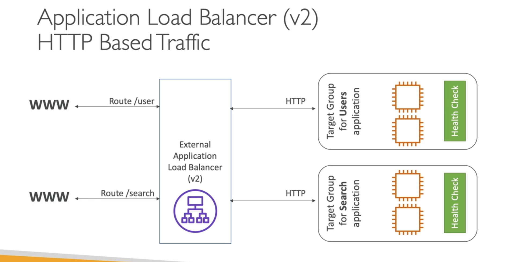

# Application Load Balancer (ALB)

* Layer 7 Load Balancer
* Load balancing to multiple HTTP applications across machines or containers.
* Supports HTTP/2 and Web Sockets
* Routing tables for different target groups (based on URL path)
* Routing based on hostname
* Routing based on query strings

ALBs are great for microservices and container-based applications.

Has a port mapping feature to redirect to dynamic port in ECS.

Classical load balancers would requre muliple load balancers per application to make all that work. 

Load Balancers can route traffic to target groups based on the above.

## Target Groups

Target groups can be any of the following:

* EC2 Instances - HTTP (remember, this is application-level, layer 7 stuff)
* ECS tasks - HTTP
* Lamba functions - HTTP request is translated into a JSON event
* IP Addresses - must be private IPs

ALB can route to multiple target groups. 

Health checks are at the target group level.

Having IP Addresses allows an ALB to route outside the AWS environment. For example, to an on-premisis data center.

## ALB Good-To-Know Facts

ALBs have a fixed hostname. Ex: xxx.region.elb.amazonaws.com.

The application servers don't see the IP of the client directly. Instead, that is encapsulated in the header X-Forwarded-For. We can also get the Port (X-Forwarded-Port) and protocol (X-Forwarded-Proto).

## ALB and Security

It is possible to use ALB to improve application security. For example, you can set your EC2 instances to only allow traffic from the ALB, creating a single entry point to the application.

## ALB Rules

It is possible to set rules on the ALB based on queriable items in the header, path, and other areas. 

One use of this is to forward a certain url path to a certain EC2 instance.

